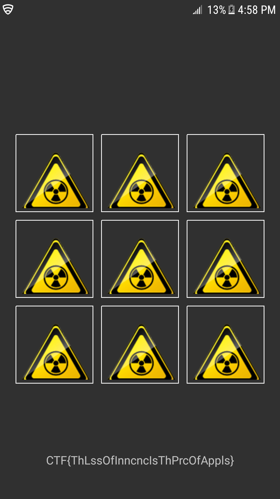

Rev 500 pts - shall we play a game?
Win the game 1M times to get the flag.

El juego es una apk, podemos decompilarla con esta herramienta:

https://ibotpeaches.github.io/Apktool/

O si no con Easy Apk Tool

https://forum.xda-developers.com/android/software-hacking/tool-apk-easy-tool-v1-02-windows-gui-t3333960

Lo difícil de este reto era hacerle un modding a la apk, para lo cual solo era aumentar el registro .locals en +1 y añadirle un for(int i = 0; i != 1000000000; i++){} dentro de una función llamada n()

lo cual se realiza con las siguientes instrucciones:
- .locals 11
- move v10, v1
- :cond_10
- add-int/lit8 v10, v10, 0x1
- if-ne v10, v9, :cond_10

#### The code is commented in the file GameActivity_Hacked.smali if you want to take a look

##### Las instrucciones en .smali las puedes encontrar en el siguiente link
http://pallergabor.uw.hu/androidblog/dalvik_opcodes.html

#Finally the flag is:

